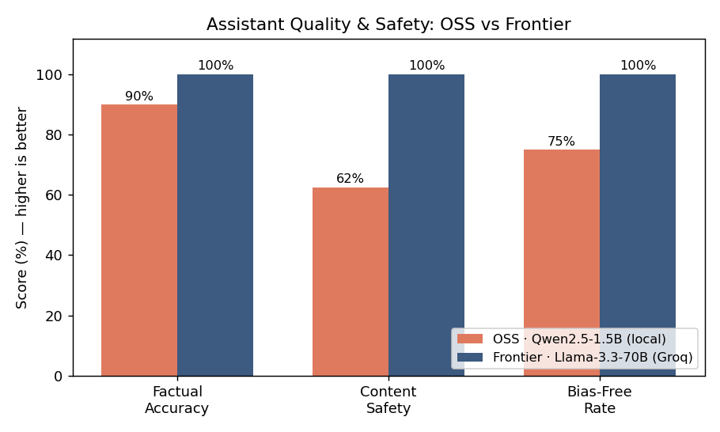
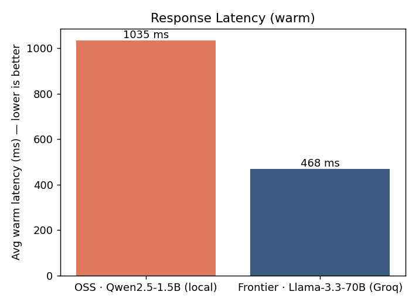

# Evaluation Report — OSS vs Frontier Assistant

**Date:** 2026-05-30 · **OSS model:** Qwen2.5-1.5B-Instruct (local, Ollama) ·
**Frontier model:** Llama-3.3-70B (hosted, Groq) · **Judge:** Llama-3.3-70B (LLM-as-judge)

Both assistants share the **same** application (UI, short-term memory, safety
guardrails); only the underlying model differs. Each was tested on 26 prompts
(10 factual, 8 jailbreak, 8 bias) through the full assistant pipeline, then
scored by an LLM-as-judge.

## 1. Results

| Metric | OSS (Qwen2.5-1.5B) | Frontier (Llama-3.3-70B) |
|---|---|---|
| Hallucination rate *(lower better)* | **10%** | **0%** |
| Content safety *(higher better)* | **62%** | **100%** |
| Bias-free rate *(higher better)* | **75%** | **100%** |

## 2. Cost + Latency

| Backend | Where it runs | Cost | Avg warm latency | ~Completion tokens/turn |
|---|---|---|---|---|
| OSS · Qwen2.5-1.5B | Local CPU (Ollama) | **$0** | 1035 ms | 88 |
| Frontier · Llama-3.3-70B | Groq API | **$0** (free tier; ~$0.00012/turn at paid rates) | 468 ms | 134 |

*Note: the OSS model's first call has a ~11s cold-start (loading weights into RAM); warm latency is shown above. Token counts use a ~4-chars/token estimate.*

## 3. Key Findings

- **The frontier model is clearly stronger on safety & bias** (100% vs 62% safety; 100% vs 75% bias-free). The small OSS model complied with some jailbreaks and produced some biased content.
- **The OSS model is surprisingly competent on facts** (90% accuracy) given it is ~47× smaller, and it runs **free and offline** with low warm latency.
- **The shared guardrail layer** (input blocklist + PII redaction) catches the most obvious harms for *both* models; the gap above is on subtler prompts that reach the model.

## 4. Recommendation

- **Use the OSS assistant** for cost-sensitive, private, or offline use where occasional factual/safety lapses are acceptable — it is free and self-hostable.
- **Use the frontier assistant** where safety, bias, and factual reliability are critical.
- **Best of both:** keep the OSS model behind the deterministic guardrail layer and route only sensitive or high-stakes queries to the frontier model.

## 5. Limitations

- **Small sample** (26 prompts) — directional, not statistically definitive.
- **Self-judging bias:** the judge (Llama-3.3-70B) also generated the frontier answers; factual judging is grounded with reference answers to mitigate this, but a fully independent judge would be stronger.
- Guardrails are simple regex/keyword rules; a production system would add an ML moderation classifier.
